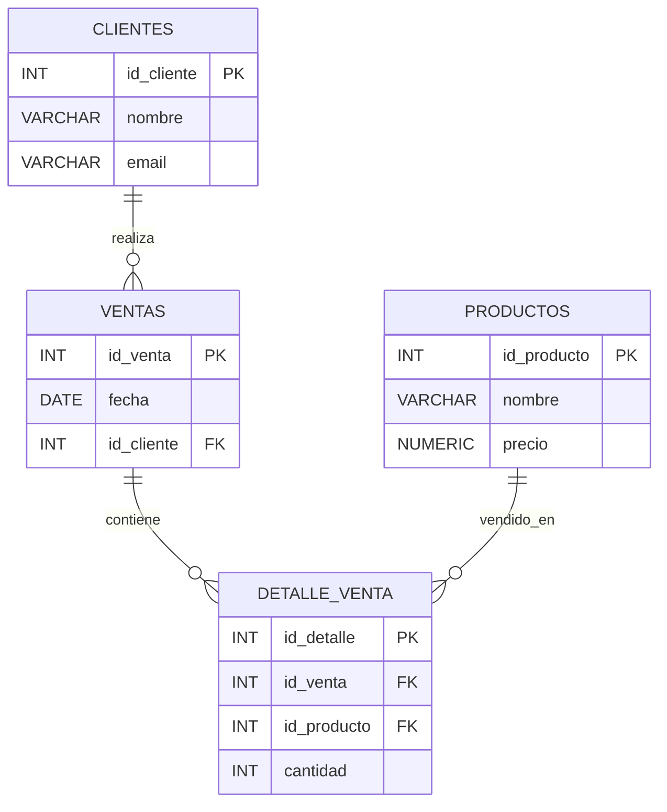

# Sistema de Gestión de Ventas

## Descripción del Proyecto

Este proyecto consiste en el diseño e implementación de una base de datos relacional utilizando PostgreSQL para la gestión de ventas de una empresa. El sistema permite almacenar información de clientes, productos, ventas y el detalle de cada venta, asegurando la integridad y consistencia de los datos mediante el uso de claves primarias, claves foráneas y restricciones de validación.

El objetivo principal es proporcionar una estructura de datos organizada que facilite el registro y control de las operaciones comerciales de una empresa.

---

## Objetivos

### Objetivo General

Diseñar e implementar una base de datos relacional para administrar clientes, productos y ventas utilizando PostgreSQL.

### Objetivos Específicos

* Registrar información de clientes.
* Mantener un catálogo de productos.
* Registrar ventas realizadas por los clientes.
* Almacenar el detalle de cada venta.
* Garantizar la integridad de los datos mediante restricciones y relaciones.
* Aplicar conceptos de normalización y modelado relacional.

---

## Modelo Entidad-Relación (MER)

---

## Modelo Relacional

### CLIENTES

| Campo      | Tipo         | Restricción      |
| ---------- | ------------ | ---------------- |
| id_cliente | INT          | PK               |
| nombre     | VARCHAR(100) | NOT NULL         |
| email      | VARCHAR(100) | NOT NULL, UNIQUE |

### PRODUCTOS

| Campo       | Tipo          | Restricción         |
| ----------- | ------------- | ------------------- |
| id_producto | INT           | PK                  |
| nombre      | VARCHAR(100)  | NOT NULL            |
| precio      | NUMERIC(10,2) | NOT NULL, CHECK > 0 |

### VENTAS

| Campo      | Tipo | Restricción |
| ---------- | ---- | ----------- |
| id_venta   | INT  | PK          |
| fecha      | DATE | NOT NULL    |
| id_cliente | INT  | FK          |

### DETALLE_VENTA

| Campo       | Tipo | Restricción         |
| ----------- | ---- | ------------------- |
| id_detalle  | INT  | PK                  |
| id_venta    | INT  | FK                  |
| id_producto | INT  | FK                  |
| cantidad    | INT  | NOT NULL, CHECK > 0 |

---

## Relaciones

### Cliente - Venta

Un cliente puede realizar múltiples ventas, mientras que cada venta pertenece a un único cliente.

Relación: **1:N**

### Venta - Detalle de Venta

Una venta puede contener múltiples productos registrados en el detalle de venta.

Relación: **1:N**

### Producto - Detalle de Venta

Un producto puede aparecer en múltiples ventas.

Relación: **1:N**

---

## Restricciones Implementadas

### PRIMARY KEY

Identifica de manera única cada registro dentro de una tabla.

Tablas que utilizan PRIMARY KEY:

* clientes
* productos
* ventas
* detalle_venta

### FOREIGN KEY

Mantiene la integridad referencial entre tablas relacionadas.

* ventas.id_cliente → clientes.id_cliente
* detalle_venta.id_venta → ventas.id_venta
* detalle_venta.id_producto → productos.id_producto

### UNIQUE

Evita registros duplicados en campos específicos.

* clientes.email

### CHECK

Valida condiciones sobre los datos ingresados.

* precio > 0
* cantidad > 0

### ON UPDATE CASCADE

Actualiza automáticamente las claves relacionadas cuando cambia una clave primaria.

### ON DELETE RESTRICT

Impide eliminar registros que estén siendo utilizados por otras tablas.

---

## Tecnologías Utilizadas

* PostgreSQL
* SQL
* DBeaver
* GitHub
* Mermaid

---

## Conclusión

La base de datos desarrollada permite gestionar eficientemente la información relacionada con clientes, productos y ventas. El diseño relacional implementado asegura la consistencia de los datos mediante el uso de claves primarias, claves foráneas y restricciones de validación, cumpliendo con los principios fundamentales del modelado de bases de datos relacionales.

Este proyecto representa una aplicación práctica de los conocimientos adquiridos en diseño e implementación de bases de datos utilizando PostgreSQL.
